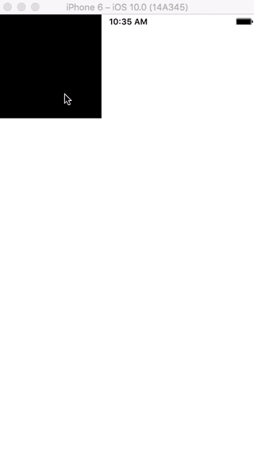

# View-Handle-Protocols
  

By simply adding a protocol, you can make your view in `movable`, `resizable`, `recallable`, and `rotatable` way.

## How It Works
`movable`, `resizable`, `rescalable` and `rotatable` protocol exposes the functionality to the view classes that conform to it, using protocol extensions.

### Example

With very little boilerplate, any subclass of `UIView` can conform to it.

~~~swift
class MovableView: UIView, Movable {
    public lazy var movableHelper: MovableHelper? = {
        return MovableHelper(view: self)
    }()
    
    public lazy var ResizableHelper: ResizableHelper? = {
        return ResizableHelper(view: self)
    }()
    
    override init(frame: CGRect) {
        super.init(frame: frame)
        
        self.addMovable()
        self.addResizable()
    }
}
~~~

## Compatibility

- iOS 9.0+
- Swift 3.0
- Xcode 8.0
